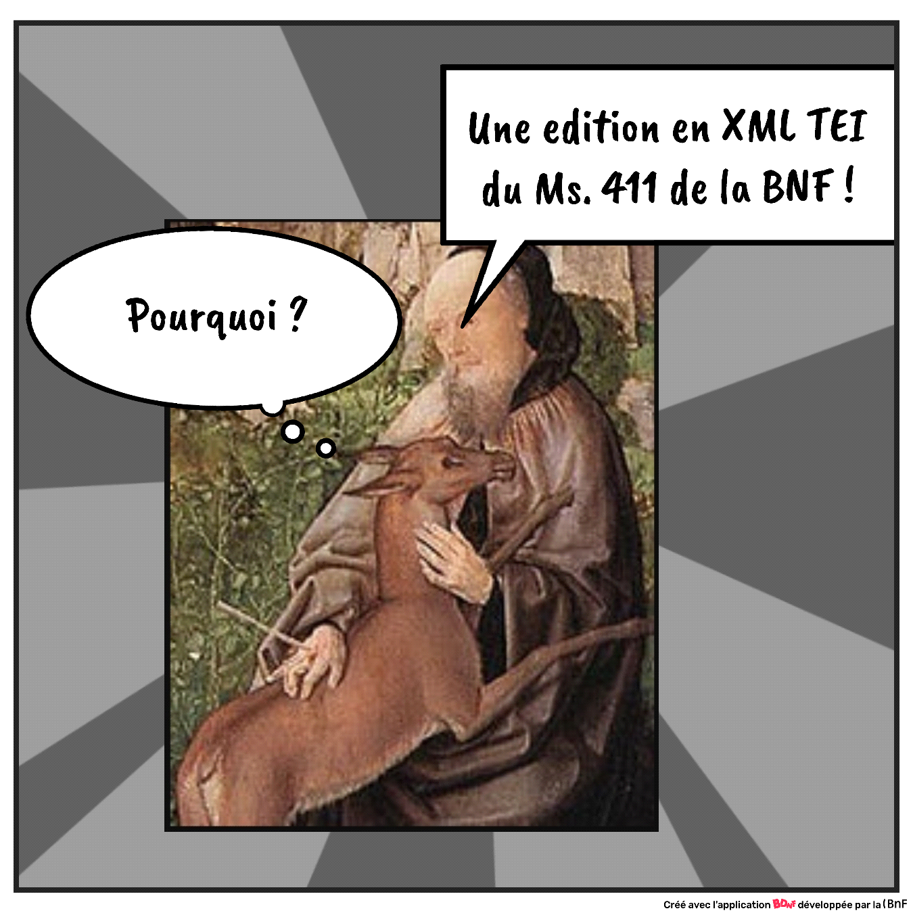

# Projet-Edition_XML-TEI_Ms411_f173a-f173c_StGilles

Projet d'une édition XML-TEI du Ms411 de la BnF dans le cadre du évaluation du master TNAH

## Consignes générales

* Structurer en XML-TEI votre texte en vue d’une édition et en respectant le genre littéraire auquel appartient votre extrait (/6);

* Compléter de la manière la plus précise possible le teiHeader de votre édition, en fonction des éléments nécessaires à son établissement et à la compréhension du texte (/3);

* Écrire un schéma ODD adapté à votre encodage et documenté. 	- Générer une ODD à partir de Roma ou de oddbyexample et associer le schéma rng correspondant à votre projet XML (/3)
	- Votre ODD doit contenir au moins :
		- Une règle contraignant l’usage d’un attribut et sa ou ses valeurs (/2);
		- Une règle contraignant l’enchaînement de certains éléments (opt. +1);
		- Une règle contraignant la valeur d’un attribut ou l’usage d’un élément ou d’un attribut en fonction de son environnement (opt. +1).
		
	- À partir de votre ODD, générer la documentation HTML de votre projet.
		- Présenter en introduction votre projet et ses exploitations possibles (/4);
		- Documenter le fonctionnement de votre encodage et vos choix de balises (/2). 
    
    
## Sujet choisi : Édition à visée paléographique : Récits hagiographiques du manuscrit 411 de la Bibliothèque nationale de France.

**Sujet n°7** : Suite 4 de la vie de saint Gilles,
fol173a-173c  « Quant il orent assez a lui parlé » à « tormentez molt griefment ».
https://gallica.bnf.fr/ark:/12148/btv1b107209247/f178.item.zoom 

* Structurer le texte fourni en divisions de type section en fonction des initiales ornées, et en paragraphes si des subdivisions vous semblent nécessaires pour le sens ;
* Renseigner le teiHeader, et plus précisément le msDesc à l’aide de la notice Gallica du manuscrit 411 et de la notice Jonas : http://jonas.irht.cnrs.fr/consulter/manuscrit/detail_manuscrit.php?projet=71287#Association ;
* Aidez-vous de l'HTR fourni pour faire votre transcription (corriger les erreurs);
* Encoder les abréviations et les normalisations graphiques de manière à conserver la graphie originale et à proposer une graphie régularisée (penser à utiliser une fonte adaptée à votre travail, ainsi qu’à proposer des entités décimales pour les caractères spéciaux);
* Faire un index des noms de personnages et de lieux ;
* Écrire l’ODD la plus restrictive possible en fonction de votre encodage ;
* Ajouter dans votre ODD la documentation sur votre projet d’encodage, les éléments que vous avez encodés : pourquoi et comment.
* Présenter comment votre encodage pourrait être exploité.

